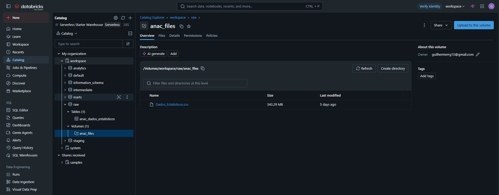
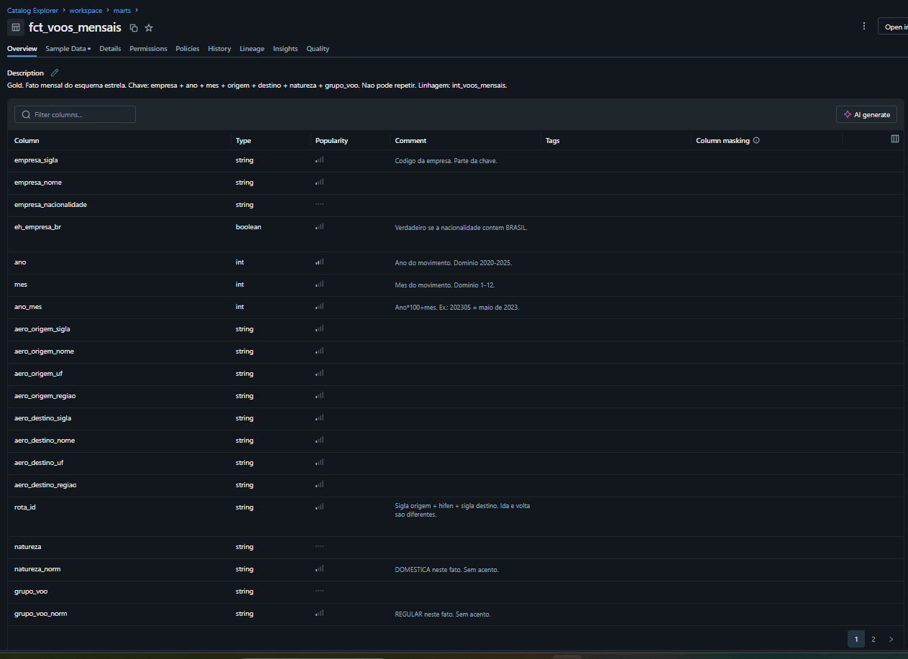
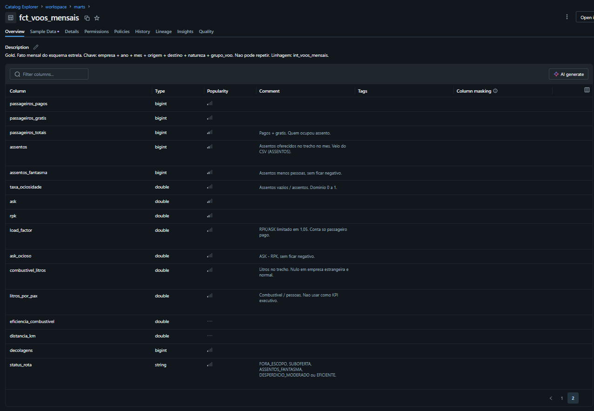
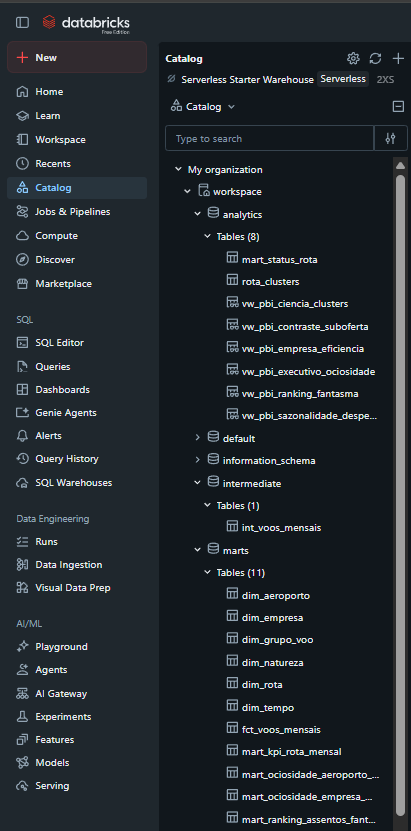
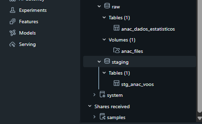

# Assentos Fantasma BR

Pipeline de dados na nuvem (Databricks Free Edition) sobre assentos de avião
que decolam vazios na malha doméstica regular do Brasil.

Os relatórios do setor costumam dizer só quantas pessoas voaram.
Este trabalho mostra o outro lado: quantos assentos foram oferecidos e não ocupados.

Recorte: voos **domésticos regulares**, **2020 a 2025**, dados públicos da ANAC.

O CSV **não** está neste repositório (arquivo grande). Código, dicionário e prints **estão**.

---

## Contexto de Negócios e Perguntas (Etapa 2 e 4.1)

### Problema

Todo mês, no Brasil, muitos assentos de avião decolam sem passageiro.
Contar só passageiro esconde o tamanho da oferta que foi embora vazia.
Quem planeja malha, aeroporto ou política pública precisa ver **os dois lados**:
pessoas que voaram e assentos que sobraram.

Assento vazio **não** significa, sozinho, que a empresa geriu mal.
Pode ser avião grande demais para a rota, ligação de serviço, aeroporto-hub,
carga ou efeito da pandemia.

### Perguntas de negócio (objetivo original — nenhuma foi apagada)

1. Quantos assentos decolam vazios na malha doméstica regular (2020–2025)?
2. Esse vazio se concentra em poucas rotas?
3. Quais rotas e empresas têm mais **volume** de assentos vazios — e quais são as mais vazias em **%**?
4. O vazio muda conforme o mês? 2020–21 é igual aos anos seguintes?
5. O vazio se concentra em alguns estados de origem?
6. Existem ao mesmo tempo rotas lotadas e rotas muito vazias?
7. O combustível por passageiro piora onde há mais assento vazio?
8. Dá para agrupar rotas em tipos (lotada, eficiente, ociosa, instável)?

A pergunta 7 ficou **parcial**. A 8 ficou com grupos que se misturam um pouco.
As duas continuam aqui de propósito. A discussão está na Análise e na Autoavaliação.

### Contexto dos dados brutos

A fonte é um único CSV público da ANAC: **Dados Estatísticos do Transporte Aéreo**.
Não usei Kaggle nem planilha pronta. O arquivo cobre 2000–2026; o projeto usa só **2020–2025**.

Uma linha do arquivo é: uma **empresa**, em um **mês**, em um trecho
**origem → destino**, com um tipo de voo (natureza e grupo).
Não é um voo isolado. É o total daquele trecho no mês.

O arquivo tem **38 colunas**. As que sustentam o problema são:
`ASSENTOS`, `PASSAGEIROS_PAGOS`, `PASSAGEIROS_GRATIS`, `ASK`, `RPK`,
`EMPRESA_SIGLA`, `ANO`, `MES`, aeroportos de origem e destino,
`NATUREZA`, `GRUPO_DE_VOO` e `COMBUSTIVEL_LITROS`.

A primeira linha do CSV **não** é nome de coluna: é um recado (`Atualizado em: …`).
Os nomes estão na segunda linha. A coluna **`ASSENTOS` existe** — não foi inventada.

Lista completa, tipos e significado: [`docs/data_dictionary.md`](docs/data_dictionary.md).
URL, tamanho e hash: [`docs/data_sources.md`](docs/data_sources.md).

### Licença

- Dado aberto do governo federal (ANAC).
- Pode usar e adaptar, **citando a ANAC**.
- Citação: Fonte: ANAC — Dados Estatísticos do Transporte Aéreo. Elaboração própria.
- A própria ANAC avisa: quem usa o arquivo bruto pode chegar em totais
  diferentes dos relatórios oficiais. **Este trabalho não é estatística oficial.**

---

## Carga dos Dados (Etapa 4.2)

A conta gratuita do Databricks **não baixa** o CSV direto da internet.
Por isso a carga foi em dois passos, os dois documentados.

1. **No computador:** baixar
   [Dados_Estatisticos.csv](https://sistemas.anac.gov.br/dadosabertos/Voos%20e%20opera%C3%A7%C3%B5es%20a%C3%A9reas/Dados%20Estat%C3%ADsticos%20do%20Transporte%20A%C3%A9reo/Dados_Estatisticos.csv)
   (~343 MB) e conferir o SHA-256 em `docs/data_sources.md`.
2. **Na nuvem:** enviar o arquivo para o Volume
   `/Volumes/workspace/raw/anac_files/Dados_Estatisticos.csv`.
3. **No notebook** [`notebooks/01_ingestao_raw.py`](notebooks/01_ingestao_raw.py):
   ler o CSV (pular a linha 1, separador `;`, UTF-8),
   ficar só com 2020–2025 (**208.946** linhas) e gravar a tabela Delta
   `workspace.raw.anac_dados_estatisticos`.

O que foi feito, por quê e o impacto:

- Pular a linha 1 — senão os nomes das colunas saem errados.
- Não inventar tipo na leitura (`inferSchema=false`) — o texto vem como texto;
  o tipo certo entra na limpeza.
- Cortar anos no `raw` — o CSV inteiro tem ~1,1 milhão de linhas;
  o projeto só precisa de anos cheios de 2020 a 2025.

Evidência do arquivo no Volume (Unity Catalog):

---

## Modelagem e Catálogo de Dados (Etapa 4.3)

### Como o modelo foi pensado

Esquema **estrela**: um fato no centro e dimensões ao redor.
O fato responde “o que aconteceu no mês”.
As dimensões respondem “quando, quem, de onde, para onde”.

Uma linha do fato `fct_voos_mensais` é:
empresa + ano + mês + aeroporto de saída + aeroporto de chegada + natureza + grupo de voo.
Essa chave **não pode repetir**.

### Camadas (bruto → limpo → pronto)

O enunciado chama isso de arquitetura medalhão.
As tabelas **não** se chamam bronze/silver/gold, mas a ordem é a mesma.

| Camada | Schema no Databricks | Tabelas | Papel |
|---|---|---|---|
| Bronze (como veio) | `workspace.raw` | `anac_dados_estatisticos` | CSV 2020–2025, colunas originais |
| Silver (limpo) | `workspace.staging` | `stg_anac_voos` | Nomes, tipos, acento tirado |
| Silver (com contas) | `workspace.intermediate` | `int_voos_mensais` | Filtro doméstico regular + métricas |
| Gold (consumo) | `workspace.marts` | fato, 6 dimensões, 4 marts | Painel e SQL |
| Gold (análise) | `workspace.analytics` | `mart_status_rota`, `rota_clusters`, views | Página de ciência e dashboard |

### Catálogo das tabelas (transcrito)

Catálogo campo a campo, com tipo, domínio e de onde veio cada coluna:
[`docs/data_dictionary.md`](docs/data_dictionary.md) (seções 1, 2 e 9).

Resumo do que cada tabela é:

| Tabela | O que é uma linha | De onde veio |
|---|---|---|
| `raw.anac_dados_estatisticos` | Empresa-trecho-mês como no CSV | Volume ANAC, anos 2020–2025 |
| `staging.stg_anac_voos` | A mesma linha, limpa | `raw` (trim, tipo, `natureza_norm`) |
| `intermediate.int_voos_mensais` | Só doméstico regular com assento | `staging` + contas (`assentos_fantasma`, `status_rota`) |
| `marts.dim_tempo` | Um ano-mês | Distintos do intermediário |
| `marts.dim_empresa` | Uma empresa | Distintos do intermediário |
| `marts.dim_aeroporto` | Um aeroporto | Origens e destinos unidos |
| `marts.dim_rota` | Um par origem-destino | Distintos do intermediário |
| `marts.dim_natureza` | Um tipo de natureza | Distintos do intermediário |
| `marts.dim_grupo_voo` | Um grupo de voo | Distintos do intermediário |
| `marts.fct_voos_mensais` | Fato mensal (grão do modelo) | Cópia analítica do intermediário |
| `marts.mart_kpi_rota_mensal` | Rota + mês (várias empresas somadas) | Agregação do fato |
| `marts.mart_ociosidade_empresa_mensal` | Empresa + mês | Agregação do fato |
| `marts.mart_ociosidade_aeroporto_mensal` | Aeroporto de origem + mês | Agregação do fato |
| `marts.mart_ranking_assentos_fantasma` | Uma rota (2022–2025, piso 10 mil assentos) | Agregação do fato |
| `analytics.mart_status_rota` | Rota-mês com selo | Cópia do KPI de rota |
| `analytics.rota_clusters` | Uma rota com tipo (k=5) | K-means no notebook `07` |

Linhagem em uma frase: **CSV ANAC → Volume → raw → staging → intermediate → fato/dims → marts/analytics**.

Print do Unity Catalog (tabela fato aberta, com colunas — um print por página da lista):

---

## Pipeline de Dados (Etapa 4.4)

O ETL **não** está em um notebook só. Cada arquivo tem um papel.
O Job `assentos-fantasma-br-mvp` roda `02` → `03` → `07` depois que o `01` já gravou o `raw`.

| Ordem | Arquivo | O que faz |
|---|---|---|
| 1 | [`notebooks/01_ingestao_raw.py`](notebooks/01_ingestao_raw.py) | Lê o Volume e grava `raw` |
| 2 | [`notebooks/02_modelo_dimensional.py`](notebooks/02_modelo_dimensional.py) | Staging, intermediário, dims, fato, marts, views |
| 3 | [`notebooks/03_qualidade.py`](notebooks/03_qualidade.py) | Testes de qualidade (não cria tabela de negócio) |
| 4–6 | [`notebooks/04_eda_desperdicio.py`](notebooks/04_eda_desperdicio.py), [`05_sazonalidade_geografia.py`](notebooks/05_sazonalidade_geografia.py), [`06_combustivel.py`](notebooks/06_combustivel.py) | Análise (gráficos e números) |
| 7 | [`notebooks/07_clusters_rotas.py`](notebooks/07_clusters_rotas.py) | Grava `analytics.rota_clusters` |
| — | [`notebooks/08_catalogo_unity.py`](notebooks/08_catalogo_unity.py) | Comentários das tabelas no Unity Catalog |
| — | [`sql/01_kpi_executivo.sql`](sql/01_kpi_executivo.sql) … [`sql/12_load_factor_anomalo.sql`](sql/12_load_factor_anomalo.sql) | 12 consultas de auditoria e análise |

### Transformações (o quê, por quê, impacto)

1. **Pular a linha 1 do CSV** — a linha é um aviso, não cabeçalho.
   Impacto: as 38 colunas ficam com o nome certo.
2. **TRIM / UPPER e tirar acento** em natureza e grupo de voo —
   no arquivo vem `DOMÉSTICA`; o filtro precisa de um valor estável.
   Impacto: o filtro `DOMESTICA` + `REGULAR` não quebra por acento.
3. **TRY_CAST** de texto para número — o CSV chega como texto.
   Impacto: dá para somar assentos e passageiros.
4. **Filtro doméstico + regular + assentos > 0** —
   o problema é oferta de assento na malha regular brasileira.
   Impacto: some internacional, não regular, improdutivo e linha só de carga.
5. **Contas novas** (`passageiros_totais`, `assentos_fantasma`, `taxa_ociosidade`,
   `load_factor`, `ask_ocioso`, `status_rota`) — o CSV não traz “assento vazio”.
   Impacto: o painel e as 12 queries leem um número já definido.
6. **Dimensões a partir do fato intermediário** — uma empresa, um mês, um aeroporto,
   uma rota viram tabelas de apoio.
   Impacto: o modelo estrela fica consultável sem reler o CSV.
7. **Marts** — somam empresas na mesma rota/mês, ou fecham ranking 2022–2025
   com piso de 10 mil assentos.
   Impacto: o dashboard não precisa recalcular o grão a cada gráfico.
8. **Cluster (notebook 07)** — junta rotas com pelo menos 12 meses e 50 mil assentos
   (2022–2025) em 5 tipos.
   Impacto: a página 5 mostra tipos, não só um ranking.

Print das tabelas gravadas no Catalog (schemas `raw`, `staging`, `intermediate`, `marts`, `analytics`):

---

## Qualidade de Dados (Etapa 4.5)

A verificação está no notebook [`03_qualidade.py`](notebooks/03_qualidade.py)
e na query [`sql/12_load_factor_anomalo.sql`](sql/12_load_factor_anomalo.sql).
Olhei os cinco eixos pedidos no enunciado.

### Completude (nulo ou vazio)

- `COMBUSTIVEL_LITROS` vem vazio em empresa estrangeira. Isso é **normal**
  (a ANAC só pede combustível de empresa brasileira). Não completei com zero.
- **2 linhas** do fato têm `ASK` nulo e `ASSENTOS > 0`. Ruído pequeno
  no volume do MVP. Não apaguei a linha; só contei.
- Passageiros nulos entram como 0 na conta de ocupação do assento
  (`COALESCE`), para não sumir o assento oferecido.

### Consistência (padrão)

- Natureza no arquivo: `DOMÉSTICA` / `INTERNACIONAL`.
  Criei `natureza_norm` sem acento (`DOMESTICA`).
- Grupo de voo: `REGULAR`, `NÃO REGULAR`, `IMPRODUTIVO`.
  O painel usa só `REGULAR`.
- Mês 1–12, ano 2020–2025 no recorte. Conferido no `raw` e no fato.

### Unicidade (duplicata)

- Chave do fato: 0 duplicata.
- Se repetisse, a tabela estaria errada (está escrito no dicionário).

### Acurácia (faz sentido?)

- Assentos e passageiros negativos: 0 no fato.
- Taxa de ociosidade fora de 0–1: 0.
- Load factor (RPK/ASK) às vezes passa de 100% por arredondamento da ANAC.
  A conta do projeto limita em **105%** e a query 12 conta quem passou.

### Extremos (outlier)

- O selo `ASSENTOS_FANTASMA` (40%+ vazios e pelo menos 10 mil assentos no mês)
  é raro. Nenhuma rota ficou assim 8 meses no mesmo ano.
  O máximo foi **4 meses**, em **4 rotas**. A query 11 foi ajustada para esse corte.
- `litros_por_pax` explode quando quase ninguém embarcou (faixa 40%+).
  Por isso essa conta **não** vai ao KPI da página 1.

Órfãos fato → dimensão (empresa, tempo, rota): 0.

---

## Análise de Dados (Etapa 4.5)

Ferramentas: SQL no Databricks, Python (Pandas + gráficos) e o dashboard
**Assentos Fantasma BR** (5 páginas). Cada pergunta do objetivo entra abaixo.
Nenhuma foi apagada.

### Pergunta 1 — Quantos assentos decolam vazios (2020–2025)?

Cerca de **115,37 milhões** de assentos vazios.
Taxa de ociosidade **19,7%**. Ocupação oficial (load factor) **81,3%**.
ASK ocioso cerca de **114,82 bilhões**.

A média da malha **não** é um desastre: 15–25% de folga é comum no setor.
Só cerca de **17%** dos assentos estão em linhas com 28% ou mais de vazio.
O problema está na cauda, não na média.

Consulta: [`sql/01_kpi_executivo.sql`](sql/01_kpi_executivo.sql).
Notebook: [`04_eda_desperdicio.py`](notebooks/04_eda_desperdicio.py).

### Pergunta 2 — O vazio se concentra em poucas rotas?

Sim na metade do desperdício; não é um 80/20 clássico.

No ranking 2022–2025 (piso de 10 mil assentos, **891** rotas):
**90 rotas** (~10%) somam **50%** dos assentos vazios.
Para chegar a 80% são **281 rotas** (~32%).

Há concentração, mas não um punhado de “vilões”.
Notebook `04` e [`sql/03_pareto_rotas.sql`](sql/03_pareto_rotas.sql).

### Pergunta 3 — Volume versus taxa: quais rotas e empresas?

As duas listas **não** são a mesma história.

- **Volume:** quem lidera são rotas grandes (ex.: São Paulo–Rio).
  Muitos vazios porque a malha é enorme; a taxa fica perto de 25%.
- **Taxa:** as “mais vazias em %” são outras, menores.
  Nessa lista, o load factor da ANAC às vezes não bate com a conta de assentos.
  Por isso a conversa de negócio usa o ranking de **volume**.

Nas empresas, o volume acompanha o tamanho da malha (TAM/LATAM, Azul, Gol).
Mais vazio em número absoluto não prova pior gestão.

### Pergunta 4 — O vazio muda com o mês? 2020–21 é igual?

Muda um pouco. **Não** misture pandemia com mês típico.

Em 2022–2025: **maio** é o mês mais vazio (**22,6%**);
**novembro** o mais cheio (**16,7%**). Julho (férias) fica perto de 17,5%.
A diferença maio vs novembro é cerca de 6 pontos: existe sazonalidade,
mas a média da malha continua perto de 20%.

2020 e 2021 são outro regime (em março da pandemia a taxa sobe muito).
Não use esses anos como “mês normal”.

### Pergunta 5 — O vazio se concentra em alguns estados de origem?

Em **volume**, sim: **São Paulo** puxa (cerca de 29 milhões de assentos vazios
em 2022–2025), depois RJ, DF e MG. Isso segue o tamanho da malha.

Em **taxa**, a história vira: estados do Norte/Nordeste com malha mais fina
ficam mais vazios em % (ex.: Acre perto de 38%).
Volume alto ≠ voar mais vazio em porcentagem.

### Pergunta 6 — Existem rota lotada e rota muito vazia ao mesmo tempo?

Sim. A maior parte dos rotas-mês fica `EFICIENTE`.
Existe `SUBOFERTA` (lotada) e existe `ASSENTOS_FANTASMA` (muito vazia).
O selo “muito vazio” no mês é **raro e intermitente**:
ninguém ficou 8 meses assim no mesmo ano (máximo = 4 meses, 4 rotas).

### Pergunta 7 — Combustível por passageiro piora com o vazio?

**Só na cauda extrema, não na malha típica.** Por isso a pergunta permanece
e a métrica **não** entrou no KPI da página 1.

Empresas brasileiras, 2022–2025, com combustível preenchido:

| Faixa de ociosidade | Litros por passageiro (média) |
|---|---:|
| 0–20% | 37,9 |
| 20–28% | 35,0 |
| 28–40% | 36,4 |
| 40%+ | 208,9 |

Até 40% o número fica estável (~36 L). No 40%+ ele explode:
o mais provável é **poucos passageiros no denominador**, não “gastou mais querosene”.
Correlação ociosidade vs litros/pax ≈ **0,20** (fraca).
Combustível só existe em empresa brasileira.

Notebook: [`06_combustivel.py`](notebooks/06_combustivel.py).
Query: [`sql/08_combustivel_vs_ociosidade.sql`](sql/08_combustivel_vs_ociosidade.sql).

### Pergunta 8 — Dá para agrupar rotas em tipos?

Dá para **tentar**, com ressalva.

683 rotas (2022–2025, pelo menos 12 meses e 50 mil assentos) foram
separadas em 5 tipos: `LOTADO`, `ALTO_VOLUME_EFICIENTE`, `OCIOSO_MODERADO`,
`OCIOSO_CRONICO`, `INSTAVEL`.

O índice de separação (silhouette) ficou **0,32**.
Os grupos se misturam um pouco. Não é uma divisão perfeita.
O gráfico de pontos mostra isso de propósito — não forcei 4 rótulos bonitos.

### Discussão geral (volta ao problema)

O problema era: **os relatórios só contam quem voou**.
O pipeline mostra a oferta que foi embora vazia, com número, lugar e mês.

O que o conjunto das respostas diz:

- Há vazio de verdade (**~115 milhões** de assentos), mas a **média** (~20%)
  não é colapso.
- Poucas rotas **grandes** explicam metade do volume. Rotas “mais vazias em %”
  são outra lista. Quem decide corte de malha precisa das **duas**.
- Mês e estado mudam o quadro, sem trocar a tese: o problema está na cauda
  e no volume das pontes grandes, não em “o Brasil inteiro voa vazio”.
- Lotado e muito vazio convivem. O “muito vazio” crônico no calendário é raro.
- Combustível e cluster **não** sustentam sozinhos uma decisão executiva.
  Entraram no objetivo, foram testados e ficaram com ressalva.

Assento vazio continua **não** sendo, sozinho, prova de má gestão.

---

## Autoavaliação

### O que o objetivo pedia e o que foi atingido

Consegui montar o ciclo completo na nuvem: pergunta → coleta documentada →
dado no Databricks → modelo estrela → ETL em notebooks → qualidade →
respostas no SQL, no Python e no dashboard.

Das 8 perguntas: **1 a 6** têm resposta numérica e print.
A **7** foi respondida só em parte (vale na faixa 40%+; não serve de KPI).
A **8** tem 5 grupos, mas a separação é fraca (0,32).
As duas ficaram no objetivo, como o enunciado pede.

### Dificuldades

- O CSV tem ~343 MB. A conta Free não baixa da ANAC pelo notebook.
  Precisei baixar no computador e enviar ao Volume.
- A primeira linha do arquivo não é cabeçalho. Se a leitura ignora isso,
  todas as colunas saem erradas.
- O corte “rota fantasma 8 meses no ano” devolveu **zero** linhas.
  O dado mostrou no máximo 4 meses. Ajustei a pergunta crônica ao que existe,
  em vez de inventar vilão.
- `litros_por_pax` engana quando quase ninguém embarcou.
- O cluster não separa tão bem quanto um exemplo de livro.

### Trabalhos futuros

- Juntar **preço** de passagem (este CSV não tem).
- Dado **voo a voo**, se a ANAC publicar no mesmo recorte.
- Melhorar o agrupamento de rotas (ou trocar por regras de negócio, sem forçar k-means).
- Atualização automática quando a ANAC republicar o CSV (o hash muda).

### Limitações que permanecem

Não há motivo do assento vazio, não há dado de cada decolagem, não há preço.
Combustível só em empresa brasileira. 2020–2021 não é mês típico.

---

## Como repetir

1. Baixe o CSV no link de `docs/data_sources.md` e envie ao Volume
   `/Volumes/workspace/raw/anac_files/`.
2. Rode [`notebooks/01_ingestao_raw.py`](notebooks/01_ingestao_raw.py).
3. Rode o Job `assentos-fantasma-br-mvp` (notebooks `02`, `03` e `07`)
   ou rode esses três na ordem.
4. (Opcional) Rode [`notebooks/08_catalogo_unity.py`](notebooks/08_catalogo_unity.py)
   para gravar as descrições no Unity Catalog.
5. Abra o dashboard **Assentos Fantasma BR**.

Feito no **Databricks Free Edition**, tabelas **Delta**, catálogo **Unity Catalog**.
Não usei Google Colab.

## O que tem neste repositório

- `notebooks/` — ingestão, modelo, qualidade, EDA, cluster e comentários do catálogo
- `sql/` — 12 consultas
- `docs/data_sources.md` — URL, tamanho e hash do CSV
- `docs/data_dictionary.md` — dicionário e catálogo das tabelas
- `docs/p01_pt1.png` … `docs/p05_pt2.png` — prints do dashboard
- `docs/catalog_volume.png`, `docs/catalog_tabelas.png`, `docs/catalog_tabelas_2.png`, `docs/catalog_fato.png`, `docs/catalog_fato_2.png` — prints do Catalog

O dashboard e as tabelas ficam no **Databricks**, não neste repo.

## O que não vai no GitHub

- O CSV da ANAC
- Senhas, token do Databricks, token do GitHub
