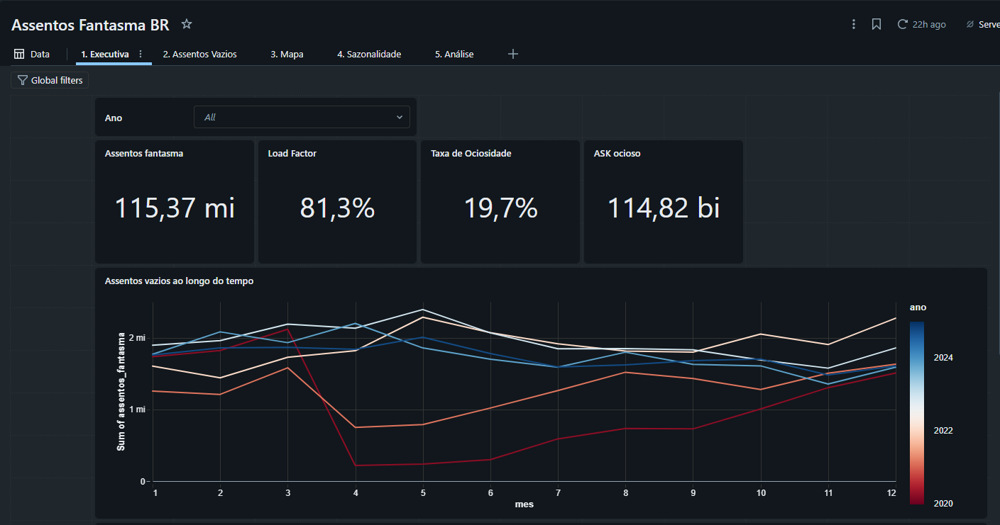
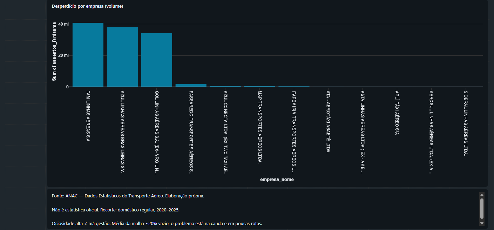
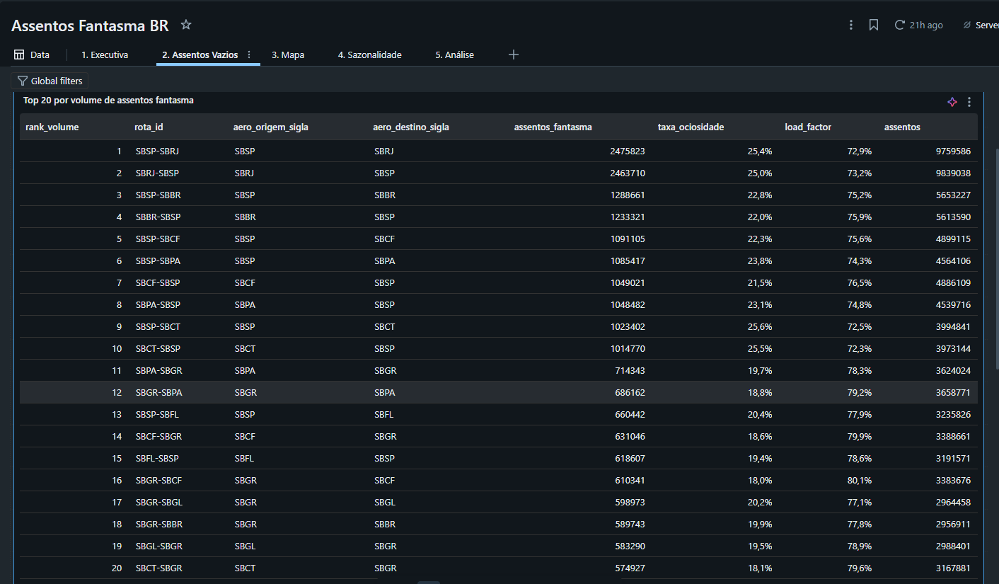
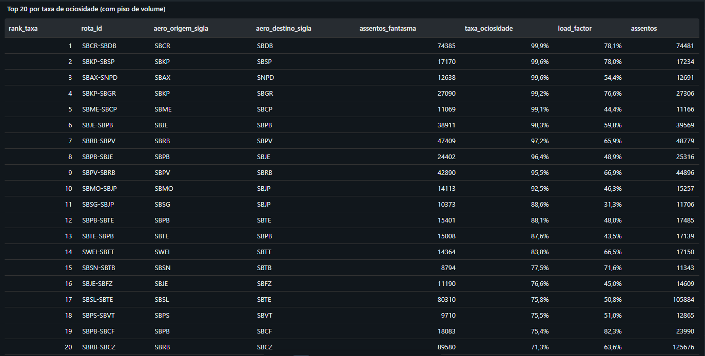
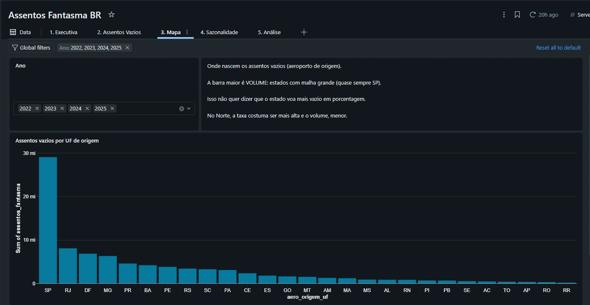
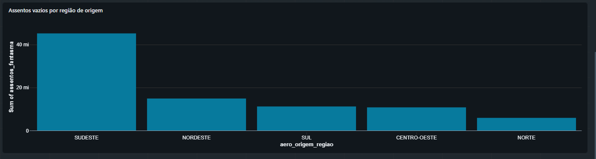
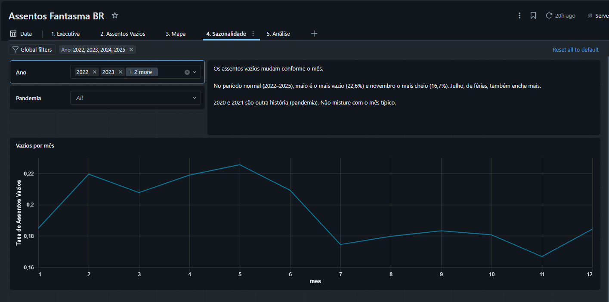
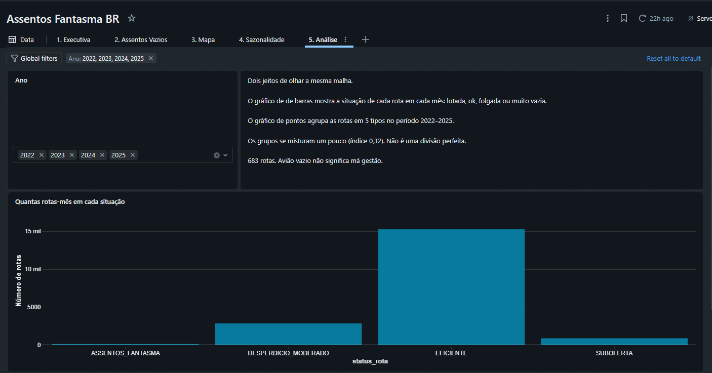
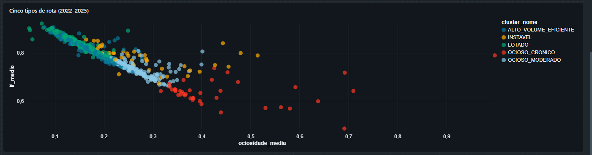

# Assentos Fantasma BR

Todo mês, no Brasil, muitos assentos de avião decolam sem passageiro.
Os relatórios do setor costumam dizer só quantas pessoas voaram.
Este projeto mostra o outro lado: quantos assentos foram oferecidos e não ocupados.

Usei dados públicos da ANAC (a agência que regula a aviação no Brasil).
Recorte: voos domésticos regulares, de 2020 a 2025.

## O que eu descobri

1. **A média da malha não é um desastre.**
   Cerca de 20% dos assentos vão vazios. Ocupação média perto de 81%.
   Só 17% dos assentos estão em linhas bem folgadas (28% ou mais vazias).
   No total, foram cerca de 115 milhões de assentos vazios no período.

2. **Poucas rotas explicam metade dos vazios.**
   Olhando 891 rotas com volume mínimo (2022 a 2025),
   90 rotas (cerca de 10%) somam 50% de todos os assentos vazios.
   Quem lidera essa lista são rotas grandes, como São Paulo–Rio:
   muitos vazios porque a malha é enorme, não porque o avião vai quase vazio
   (nessa rota a taxa fica perto de 25%).
   As rotas “mais vazias em %” são outras, menores — e nessa lista
   um indicador da ANAC às vezes não bate com a conta de assentos.
   Por isso o ranking que importa na conversa é o de VOLUME.

3. **Existe rota lotada e rota muito vazia ao mesmo tempo.**
   O “muito vazio” no mês é raro. Nenhuma rota ficou assim
   8 meses no mesmo ano (o máximo foi 4 meses, em só 4 rotas).
   Nos anos normais (2022 a 2025), maio é o mês mais vazio (22,6%)
   e novembro o mais cheio (16,7%).
   2020 e 2021 são pandemia: não use como mês típico.

Assento vazio não significa, sozinho, que a empresa geriu mal.
Pode ser avião grande demais para a rota, ligação de serviço,
aeroporto-hub, carga ou efeito da pandemia.

## De onde vêm os dados

- ANAC — Dados Estatísticos do Transporte Aéreo (dado aberto)
- Arquivo baixado em 21/09/2026. Detalhes e código de verificação
  estão em `docs/data_sources.md`
- Este trabalho **não** é um número oficial da ANAC

## Como repetir o projeto

1. Baixe o CSV no site da ANAC e envie para o Volume do Databricks.
2. Rode o notebook `01_ingestao_raw`.
3. Rode o Job `assentos-fantasma-br-mvp`
   (ou os notebooks `02`, `03` e `07`, nessa ordem).
4. Abra o dashboard **Assentos Fantasma BR** (5 páginas).

Feito no Databricks Free, com tabelas Delta e um agrupamento
simples de rotas (5 grupos, 683 rotas).

## O que este projeto não tem

- Preço da passagem
- Motivo de o assento ter ido vazio
- Dado voo a voo (só mês)
- Combustível nas páginas principais (só empresas brasileiras
  informam; a conta “litros por passageiro” engana quando
  quase ninguém embarcou)

## O que tem neste repositório

- `notebooks/` — ingestão, modelo, qualidade, EDA e cluster
- `sql/` — 12 consultas de análise
- `docs/data_sources.md` — URL, data do download e hash do CSV
- `docs/p01_executiva.png` … `docs/p05_analise.png` — prints do dashboard
- O dashboard em si e as tabelas ficam no **Databricks**, não neste repo

## O que não vai no GitHub

- O CSV da ANAC. Baixe de novo pelo link em `docs/data_sources.md`
- Senhas, token do Databricks, token do GitHub

## Licença

Os dados são da ANAC: use com atribuição.

## Telas do dashboard

